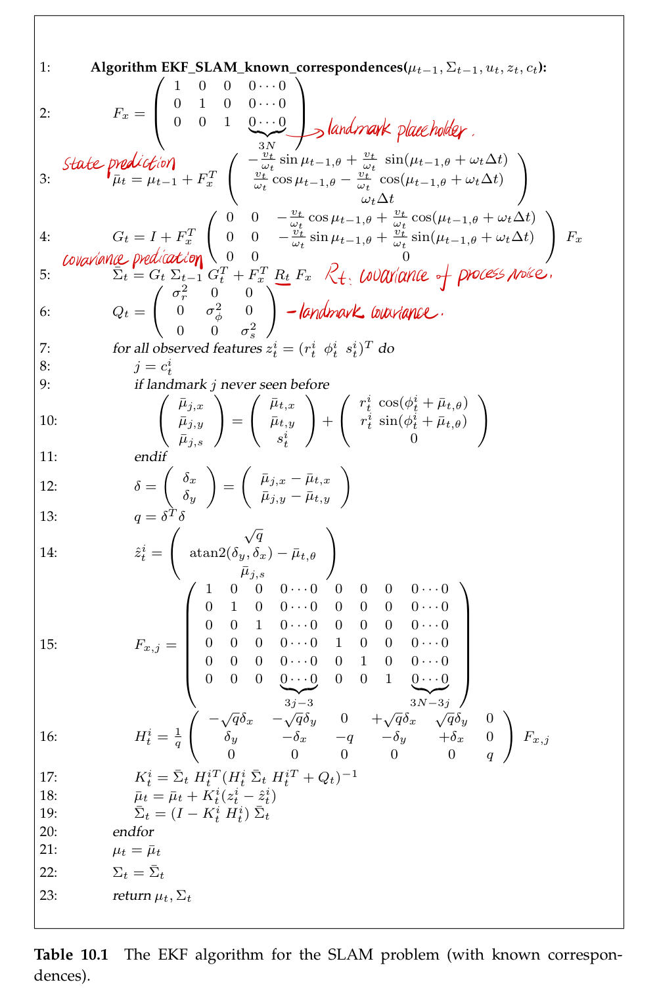
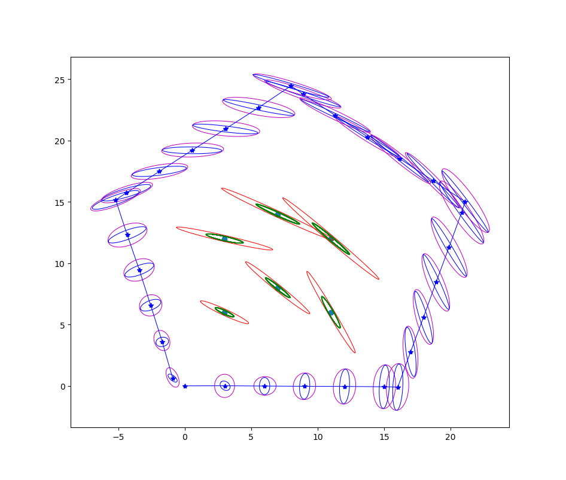

# SLAM using Extended Kalman Filter

This is the homework in CMU 16833-Robot Localization and Mapping. The Extended Kalman Filter with known correspondences is implemented in this homework. In addition to estimating the robot pose, the EKF SLAM algorithm also estimates the coordinates of all landmarks encountered along the way. This makes it necessary to include the landmark coordinates into the state vector. The implementation is same as the Table 10.1 in [1].

The fact that the Kalman gain is fully populated for all state variables - and not just the observed landmark and the robot pose - is important. In SLAM, observing a landmark does not just improve the position estimate of this very landmark, but that of other landmarks as well. This effect is mediated by the robot pose: Observing a landmark improves the robot pose estimate, and as a result it eliminates some of the uncertainty of landmarks previously seen by the same robot. This dependence is captured in the Gaussian posterior, more specifically, in the off-diagonal covariance elements of covariance matrix.

The EKF SLAM algorithm applies the extended Kalman filter to the online SLAM problem. With known correspondences, the resulting algorithm is incremental. Updates require time quadratic in the number of landmarks in the map. When correspondences are unknown, the EKF SLAM algorithm applies an incremental maximum likelihood estimator to the correspondence problem. 

The EKF SLAM algorithm is inapplicable to the full SLAM problem. In the full SLAM problem, the addition of a new pose to the state vector at each time step would make both the state vector and the covariance grow without bounds. Updating the covariance would therefore require an ever-increasing amount of time, and the approach would quickly run out of computation time no matter how fast the processor.

## Results

## Academic Integrity Policy

Students at Carnegie Mellon are expected to produce their own original academic work. Please think carefully when you are using the codes and do not violate academic integrity policy.

## Reference:

[1] S. Thrun, W. Burgard, and D. Fox, Probabilistic robotics. MIT press, 2005.